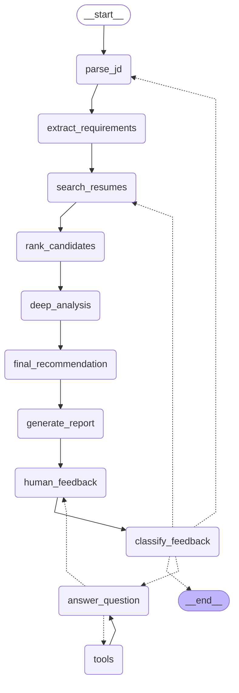

# Agent state machine

```mermaid
---
config:
  flowchart:
    curve: linear
---
graph TD;
	__start__([<p>__start__</p>]):::first
	parse_jd(parse_jd)
	extract_requirements(extract_requirements)
	search_resumes(search_resumes)
	rank_candidates(rank_candidates)
	deep_analysis(deep_analysis)
	final_recommendation(final_recommendation)
	generate_report(generate_report)
	human_feedback(human_feedback)
	classify_feedback(classify_feedback)
	answer_question(answer_question)
	tools(tools)
	__end__([<p>__end__</p>]):::last
	__start__ --> parse_jd;
	answer_question -.-> human_feedback;
	answer_question -.-> tools;
	classify_feedback -.-> __end__;
	classify_feedback -.-> answer_question;
	classify_feedback -.-> parse_jd;
	classify_feedback -.-> search_resumes;
	deep_analysis --> final_recommendation;
	extract_requirements --> search_resumes;
	final_recommendation --> generate_report;
	generate_report --> human_feedback;
	human_feedback --> classify_feedback;
	parse_jd --> extract_requirements;
	rank_candidates --> deep_analysis;
	search_resumes --> rank_candidates;
	tools --> answer_question;
	classDef default fill:#f2f0ff,line-height:1.2
	classDef first fill-opacity:0
	classDef last fill:#bfb6fc
```
